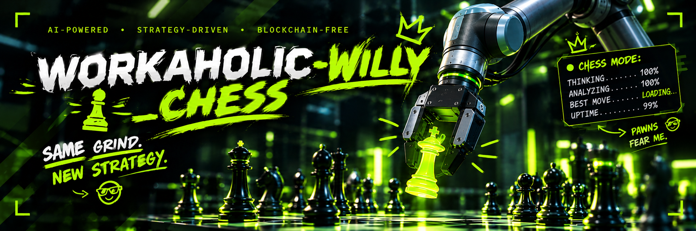

<!-- ────────────────────────────────────────────────────────────────────────── -->
<div align="center">



<br>

**Say _what_ to pick. Willy perceives it, plans a collision-free 6-DoF grasp, gates every motion through
a fail-closed safety pipeline, executes on a real or simulated arm, then checks the hold, recovers and logs.**

<br>
</div>
<!-- ────────────────────────────────────────────────────────────────────────── -->

## 🚀 Quick Start

**Validated on Windows 10&11**

```bash
python -m venv .venv
source .venv/bin/activate            # Windows: .\.venv\Scripts\Activate.ps1
git clone https://github.com/ManterJochen/Workaholic-Willy.git external/Workaholic-Willy
pip install -r requirements.txt      # everything, with CUDA torch wheels that also import without a GPU
pip install -e .\external\Workaholic-Willy --no-deps
```

## Repositories used in here

- [Workaholic-Willy](https://github.com/ManterJochen/Workaholic-Willy)
- [Stockfish](https://github.com/official-stockfish/Stockfish)
- [Chessboard](https://github.com/Elucidation/ChessboardHarmonicDetect)
- [Chessboard-ML](https://github.com/Elucidation/ChessboardDetect)